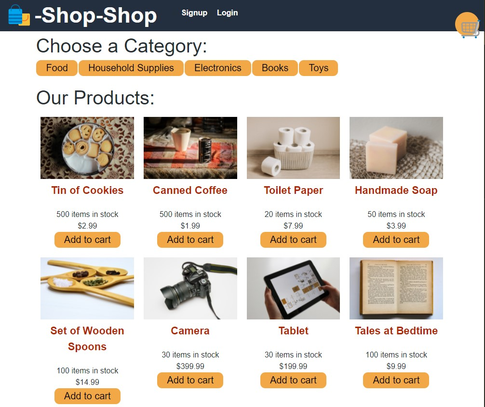
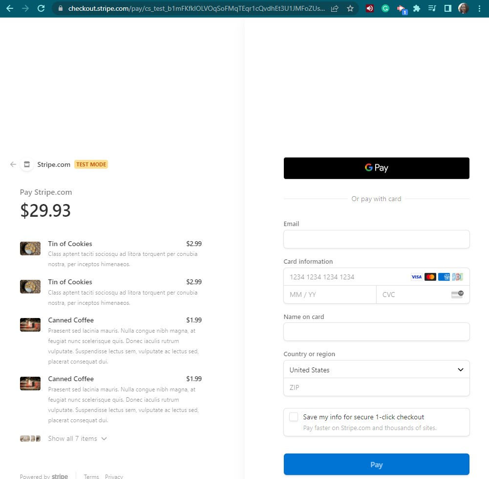

# shop-shop

## Description

This repository is for an ecommerce application built with a MongoDB, Apollo, GraphQL, React, with Stripe payment implemented and deployed to Heroku.

You may view the deployed application by [clicking this link](https://powerful-cliffs-30975.herokuapp.com/).

## Images

**Below are a screenshots of the app showing the functionality:**
 
  
 

  
 

  
 

## Contributing

## Credits

**The following resources were used to complete this project:**
1. UCONN Coding Bootcamp's modules on State with Stripe Implementation
2. [React useEffect](https://reactjs.org/docs/hooks-effect.html) Documentation 
3. [Appollo Client](https://www.apollographql.com/docs/tutorial/client) Documentation 
4. [GraphQL](https://graphql.org/learn/) Documentation
5. [Stripe](https://stripe.com/docs) Documentation

## License

